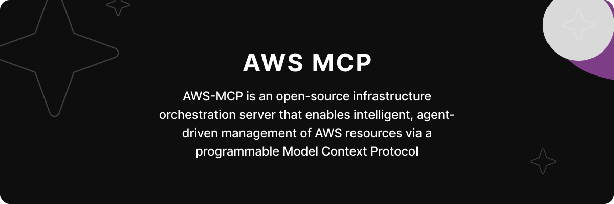

<div align="center">
  
</div>

## 🎬 Demo

See it in action! Here's how easy it is to spin up a full-blown EC2 setup — VPC, subnets, security groups, this works — all through natural language prompts to an AI Model Context Protocol (MCP) server.

<div align="center" style="margin-top:20px;margin-bottom:20px;">

</div>

---

## ✨ Features

Currently supports

1. RDS
2. S3
3. EC2
4. VPC
5. Subnet
6. Internet Gateway
7. Route Table
8. Security Group
9. Key Pair
10. Instance Tag
11. AMI

More AWS services (like Lambda, API Gateway, etc.) coming soon! Contributions welcome 🚀

---

## 📋 Prerequisites

- **Node.js** >= 18.0.0
- **pnpm** >= 10.0.0
- **AWS Account** with AWS credentials(Access Key ID and Secret Access Key)

---

## ⚙️ Developer Setup

### 1. Clone the repo

```bash
git clone https://github.com/lokeswaran-aj/aws-mcp.git
cd aws-mcp
```

> ❗️Currently, the server reads credentials from MCP configuration headers. In future versions, we'll support AWS Role ARN.

### 2. Install dependencies

```bash
pnpm install
```

> 💡 Make sure you have `pnpm` installed globally. If not:
>
> ```bash
> npm install -g pnpm
> ```

### 3. Run the dev server

```bash
pnpm dev
```

---

## 🧪 Example: Windsurf Configuration

To use this server with [Cursor](https://cursor.com), add the following to your `~/.cursor/mcp.json`:

```json
{
  "mcpServers": {
    "aws": {
      "serverUrl": "http://localhost:8080/mcp",
      "headers": {
        "AWS_ACCESS_KEY_ID": "YOUR_AWS_ACCESS_KEY_ID",
        "AWS_SECRET_ACCESS_KEY": "YOUR_AWS_SECRET_ACCESS_KEY",
        "AWS_SESSION_TOKEN": "YOUR_AWS_SESSION_TOKEN"
      }
    }
  }
}
```

> ❗️ Use `http://localhost:8080/mcp` if your client supports HTTP streamable(For eg: Cursor). Use `http://localhost:8080/sse` if your client supports only SSE(For eg: Windsurf).

MCP HTTP streamable endpoint: [http://localhost:8080/mcp](http://localhost:8080/mcp)

MCP SSE endpoint: [http://localhost:8080/sse](http://localhost:8080/sse)

---

## 📁 Project Structure

```bash
.
├── src/
│   ├── server.ts             # AWS MCP server setup - Entry point
│   ├── aws-clients.ts        # AWS SDK client setup
│   ├── config/               # App configuration
│   ├── tools/                # Tools definitions
│   │   ├── rds/              # RDS operations
│   │   ├── s3/               # S3 operations
│   │   ├── ec2/              # EC2 operations
│   │   ├── vpc/              # VPC operations
│   │   ├── subnet/           # Subnet operations
│   │   ├── internet-gateway/ # Internet Gateway operations
│   │   ├── route-table/      # Route Table operations
│   │   ├── security-group/   # Security Group operations
│   │   ├── key-pair/         # Key Pair operations
│   │   ├── instance-tag/     # Instance Tag operations
│   │   ├── ami/              # AMI operations
│   ├── schema/               # Tool input schemas
│   ├── types/                # TypeScript definitions
│   └── utils/                # Helper functions
├── package.json              # Dependencies and scripts
└── README.md                 # This file
```

---

## 📌 Roadmap

- [x] Support RDS (Create, List, Update, Delete)
- [x] Add S3 tools
- [x] Add Network tools
- [x] Add EC2 tools
- [ ] Add Lambda tools
- [ ] Add API Gateway tools
- [ ] Add IAM tools
- [ ] Add ECS tools

---

## 🤝 Contributing

Want to help make AWS infra chat-native?
Pull requests, feedback, and feature suggestions are welcome!

- Clone and fork the repo
- Create your feature branch (`git checkout -b feat/add-ec2`)
- Commit and push
- Open a PR 🙌

---

## 📄 License

MIT — do what you want, just give credit where it's due. ✌️

---

## ⚡ Powered by

- [Model Context Protocol](https://modelcontextprotocol.io/introduction)
- [FastMCP](https://github.com/fastmcp/fastmcp)
- [AWS SDK for JS (v3)](https://docs.aws.amazon.com/AWSJavaScriptSDK/v3/latest/)
